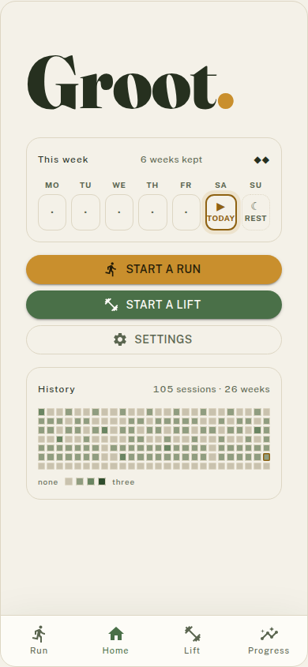
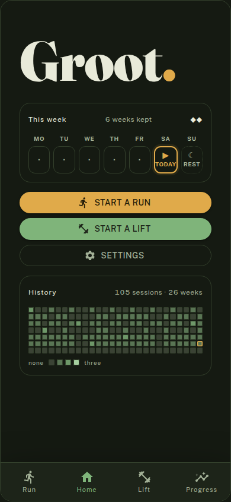
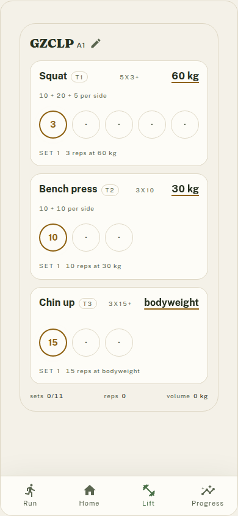
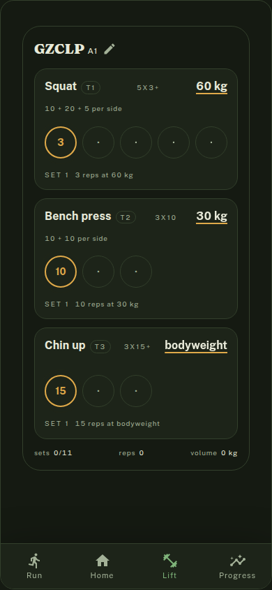
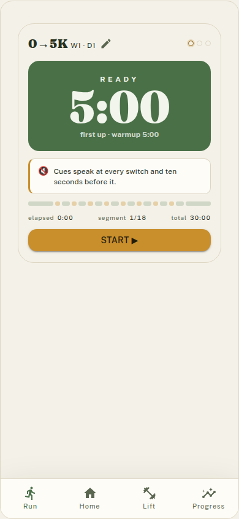
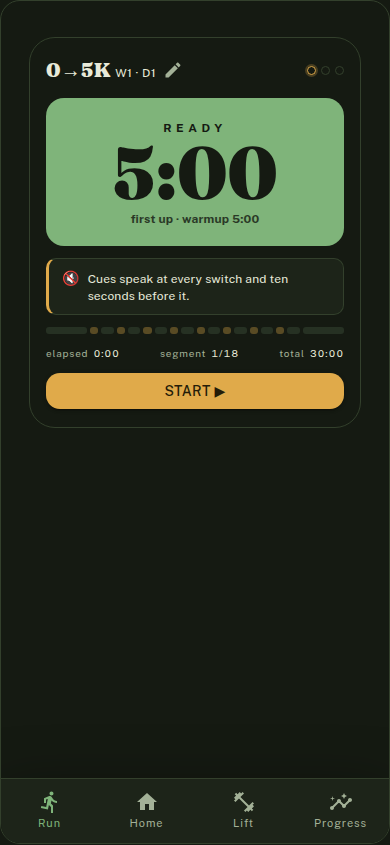
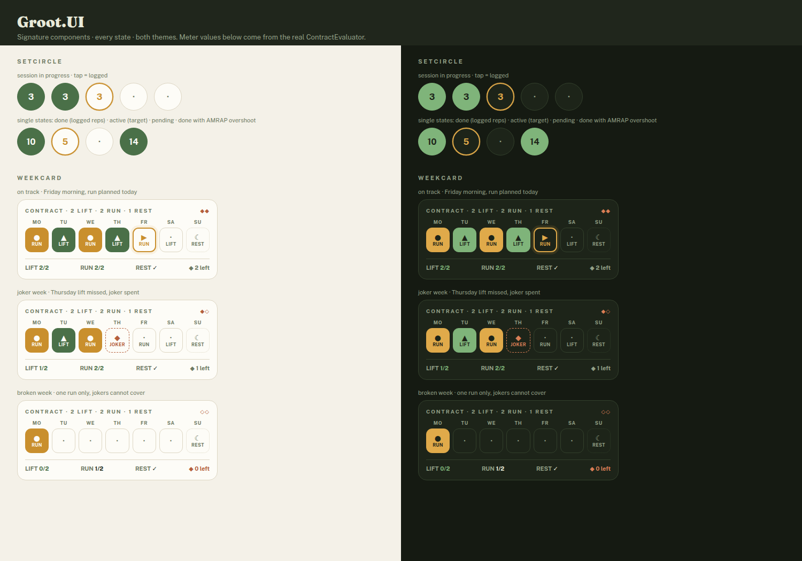
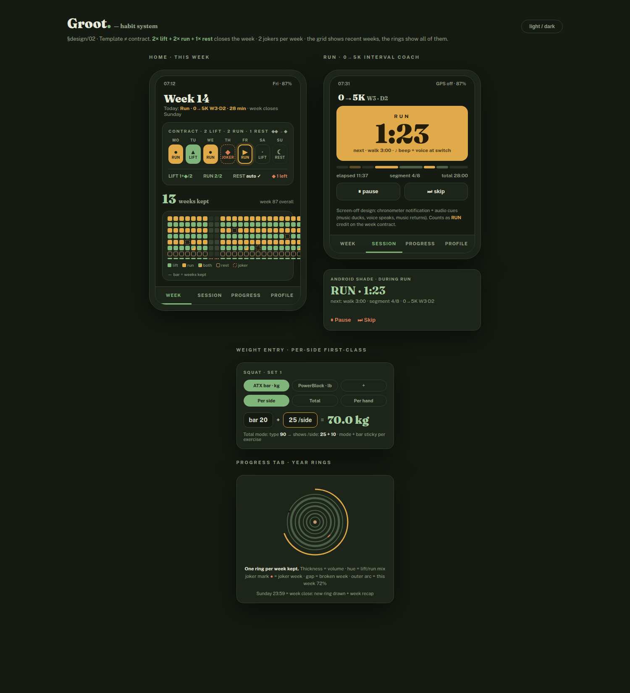
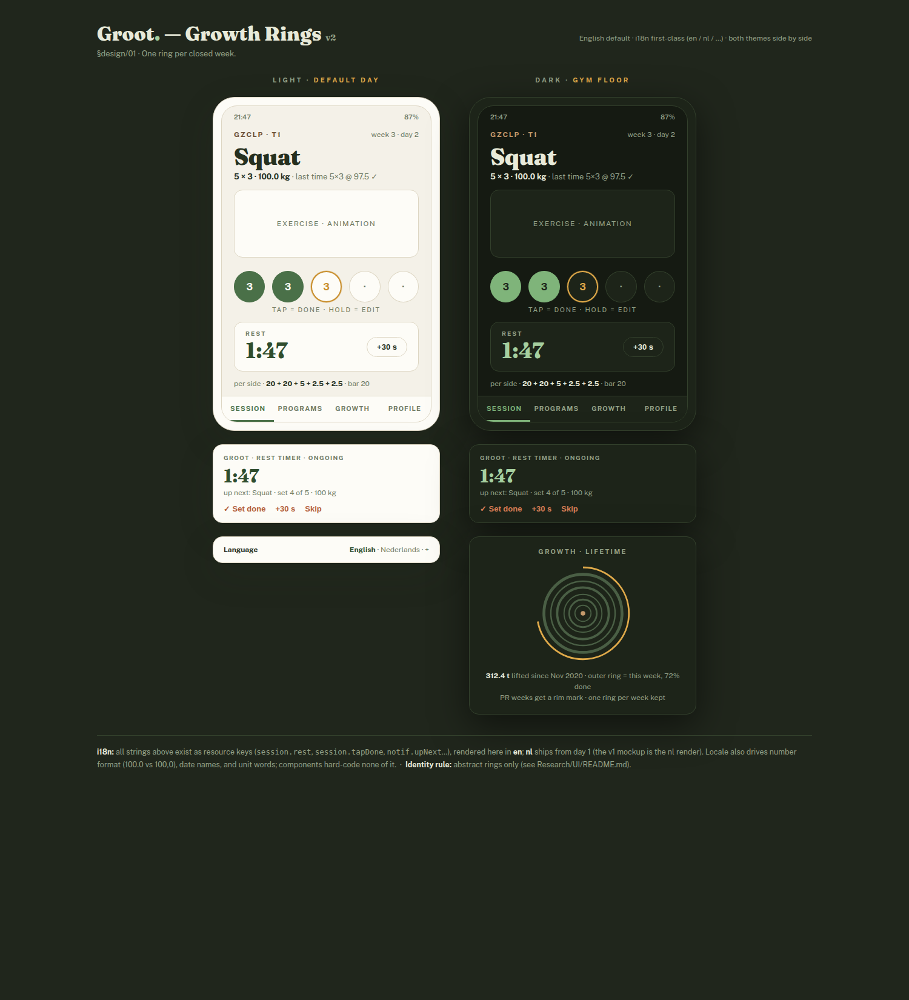
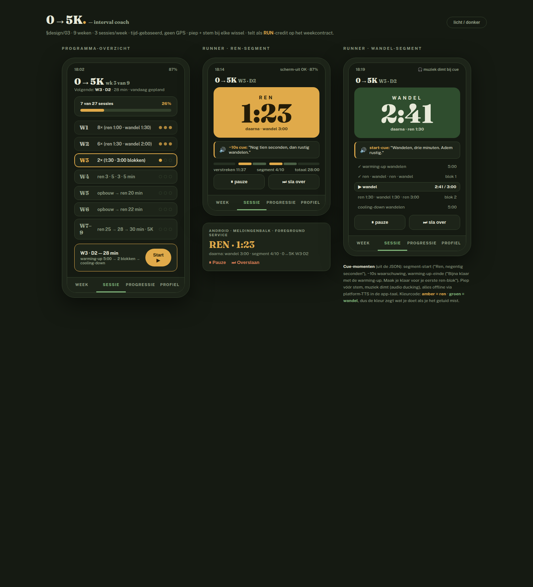

# Groot

Barbell sets and interval runs in one log, with a weekly contract that decides what counts as a
kept week. One C# codebase for web, Android and iOS: .NET MAUI Blazor Hybrid, MudBlazor for
chrome, Dapper on SQLite for the device store, and a self-hosted ASP.NET Core Minimal API for
sync. No hosted backend, no third party in the critical path.

Status, honestly: the engines work, the screens render, the store persists, and none of it is
wired together yet. The screens still open on hardcoded defaults instead of reading what you
logged. 277 tests cover what exists, and [`docs/test-coverage.md`](docs/test-coverage.md) is
explicit about what they do not cover.

## Screenshots

Real components at 390x844, captured from `tools/Groot.UI.Gallery`, light and dark.

| | Light | Dark |
|---|---|---|
| Home: the week contract, the streak, six months of history |  |  |
| Lift: GZCLP day A1, one tap per set |  |  |
| Run: 0→5K week 1, spoken cues |  |  |

The lift screen is where the awkward part of GZCLP shows: squat appears twice a rotation, as a
heavy T1 five-by-three and as a lighter T2 three-by-ten, each climbing on its own ladder. A
working weight belongs to an exercise and a tier, not to an exercise.

Every component in every state, both themes:



Design mockups, with the interactive HTML in [`design/`](design/):

| Habit contract, season grid, year rings | Identity study | 0→5K interval runner |
|---|---|---|
|  |  |  |

## What works

The engines, in `Groot.Core`, pure and unit-tested. GZCLP progression including the fail ladder
and the reset at the bottom of it. Plate maths against a real rack, so a proposed weight is one
the bar can actually be loaded to. Interval schedules with cue points. The weekly contract.

The screens, in `Groot.UI`. Home, lift, run, boot and the empty states, in both themes.

The store, in `Groot.Data`. SQLite on the device, holding sessions and their sets, equipment and
settings. Working weights are not stored anywhere: they are replayed from the sessions you
logged, which means a changed progression rule takes effect at once and a session arriving from
another device recomputes instead of sitting next to a stale number.

## What does not

The screens do not read the store. That wiring is the next piece and the reason nothing you log
survives a restart yet.

`Groot.Api` does not exist, so neither does sync. When it does, accounts are a username and a
password, with no personal data behind them.

There is no settings screen, so the equipment profile is a hardcoded rack. There is no Progress
screen, and the shape it should take is still being argued: `tools/Groot.UI.Gallery` serves five
candidates at `/progress`.

Health Connect is not integrated. The plan is to write workouts out and read sleep back for
recovery context.

## Repo layout

| Path | Contents |
|---|---|
| `AGENTS.md` | the rules for every change, agents and people alike. `CLAUDE.md` imports it |
| `research.md` | research and the decision log |
| `design/` | habit system spec and mockups. Open the HTML in a browser |
| `Research/` | program catalog, rejected design directions with provenance |
| `data/programs/` | program definitions as JSON. GZCLP rack edition, 0→5K |
| `data/log.csv` | training log in Strong-compatible CSV |
| `docs/screenshots/` | rendered previews of the screens, the gallery, the mockups |
| `docs/test-coverage.md` | what every test covers, what a failure would mean, what is untested |
| `Plan/` | one card per piece of work, with what was decided and what was deferred |
| `src/Groot.Core` | the engines. Pure functions, no framework, the tests are the spec |
| `src/Groot.Data` | the store. Schema, connection factory, one repository per aggregate |
| `src/Groot.UI` | components and design tokens, shared by every head |

## Building

```bash
dotnet test tests/Groot.Core.Tests            # domain engines, no workloads needed
dotnet test tests/Groot.Data.Tests            # the store, against a real SQLite file
dotnet build src/Groot.Web                    # Blazor WASM PWA
dotnet run --project tools/Groot.UI.Gallery   # every component and screen, both themes
```

The MAUI head needs its workload. Windows:
`dotnet build src/Groot.App -f net10.0-windows10.0.19041.0` after `dotnet workload install maui`.
Android needs the SDK and a JDK once, through
`dotnet build src/Groot.App -f net10.0-android -t:InstallAndroidDependencies` or Visual Studio.
iOS builds on a Mac. CI builds everything except `Groot.App`, which is verified on a device.

Before a commit, run the two test suites above plus `dotnet test tests/Groot.UI.Tests` for
palette contrast and component rendering, and `bash tools/check-rules.sh` for the mechanical half
of `AGENTS.md`.

## Credits

GZCLP is based on the GZCL method by Cody Lefever.

Exercise media from [exercises-dataset](https://github.com/vavdb/exercises-dataset) (MIT) and
[free-exercise-db](https://github.com/yuhonas/free-exercise-db) (public domain).

## License

Apache 2.0. See [LICENSE](LICENSE).
